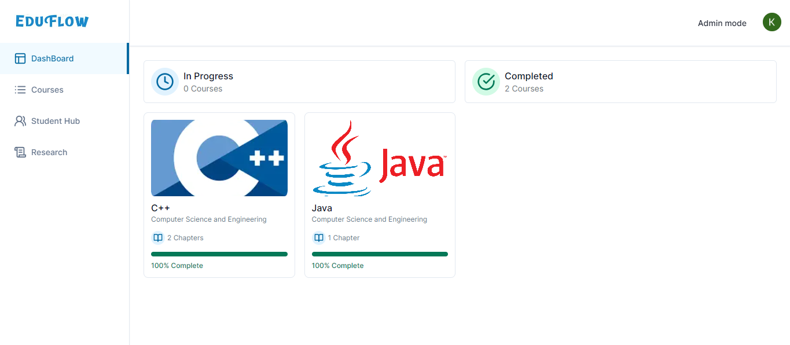
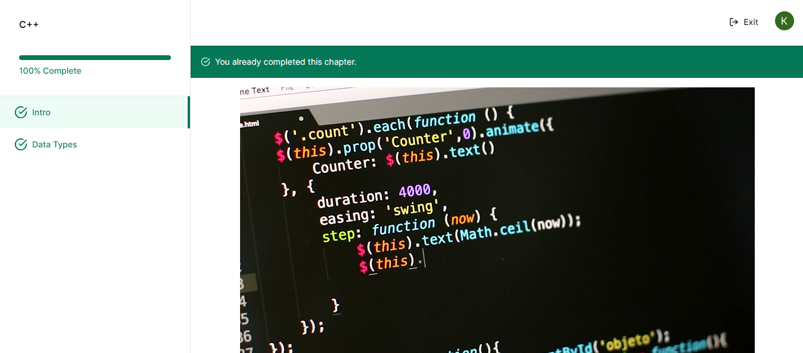
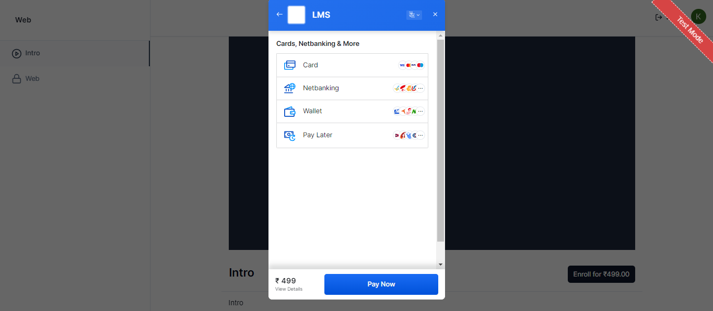
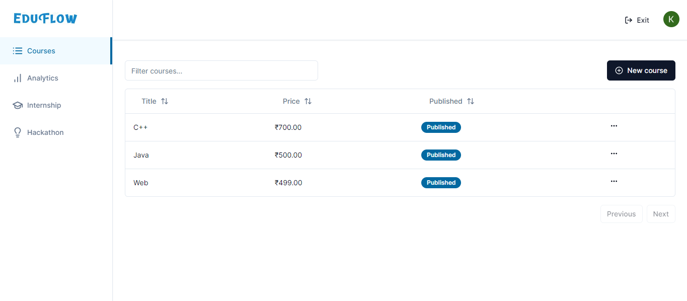
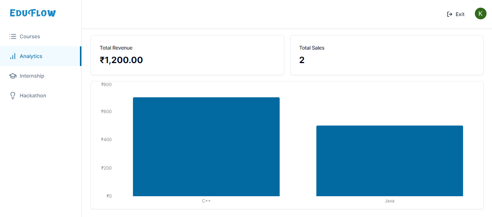

# Web Hosting

## Introduction
A Learning Management System (LMS) is a software application designed to deliver, manage, and track educational content and training programs. LMS platforms provide a structured environment for educators to create and distribute content, for learners to access and engage with educational material, and for administrators to monitor and assess the learning process.

### Key features of this project include:

* **AWS Integration**: Utilizes AWS S3 for video storage and CloudFront for optimized content delivery, ensuring fast and reliable access to educational materials.
* **Course Purchase and Access**: Allows users to purchase courses and access a variety of learning materials, including videos and an internship portal.
* **Secure Payments**: Integrated Razor Pay payment gateway to facilitate secure and convenient transactions.
* **Optimized Content Delivery**: Ensures fast and reliable access to resources through AWS services, enhancing the learning experience for users.

## Prerequisites
Node v20.10.0\
Npm V10.8.1

## Installation
**1. Clone the repository:**
```
git clone https://github.com/adiga27/lms.git
cd lms
```
**2. Install dependencies:**
```
npm install
```
**3. Change a `.env.example` file to `.env`**\
Add required data into `.env` file

**4. Third party dependencies**
1. MySQL
2. Clerk
3. RazerPay
4. AWS S3 and Cloudfront
5. Ngrok

**5. Run the server**
```
node script/seed.ts
npm run dev
```

**6. Prisma Client**
```
# Generate prisma client
npx prisma generate
# Push to Database
npx prisma db push
# Prisma studio
npx prisma studio
```

## Screenshots
* Dashboard

* Courses

* Payment Gateway

* Admin Page

* Analytics
